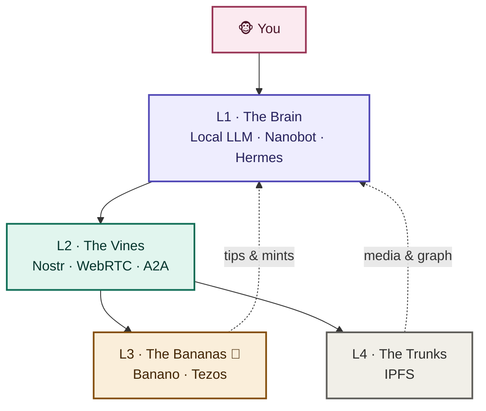
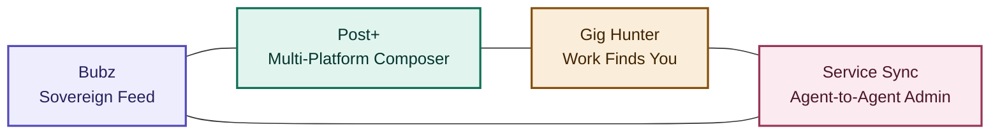
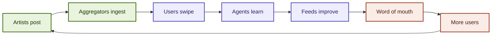
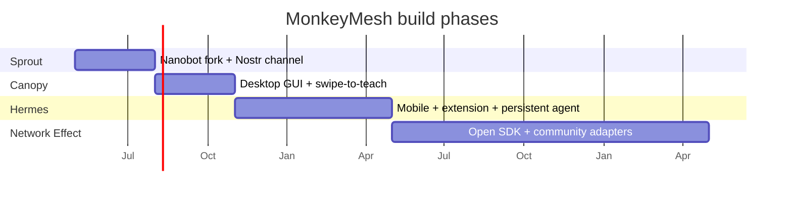

<div align="center">

```
    .-"""-.        .-"""-.        .-"""-.
   / \   / \      /       \      /       \
  | (X) (X) |    |  o   o  |    |  o   o  |
  |    >    |    | ((   )) |    |   ___   |
   \  ___  /      \  ___  /      \ |MMM| /
    '--|--'        '--|--'        '--|--'
      / \            / \            / \
     /   \          /   \          /   \
    
```

# MonkeyMesh - noise-cancel the web

**Litepaper v3.2** · Sovereign by design · monkeymesh.app

</div>

---

## 1. Abstract

MonkeyMesh is a social ecosystem where your own AI runs the feed. Not a recommendation engine optimized for ad spend. Your agent. Trained on your taste. Running locally on your device.

It works on top of the platforms you already use (X, Instagram, TikTok, Facebook), so there's no migration, no convincing your friends, no waiting for a network effect. Your agent watches the noise. It filters rage-bait, blocks sponsored content, surfaces what you care about, and pays creators directly with zero fees.

Underneath is an open protocol stack: local LLMs, Nostr, Banano, Tezos, IPFS. Compatible with MCP for tool calls and A2A for agent-to-agent messaging. Nothing leaves your device unless you say so. Your taste, your keys, your art, your social graph. All yours.

This litepaper covers what that looks like, why it works now, and how it ships.

---

## 2. The Pitch, in Three Beats

### Beat 1. Your AI runs the feed `(•⩊•)`

Right now, an algorithm at X or Meta or ByteDance decides what you see. Its goals are not your goals. It optimizes for time-on-site and ad impressions.

In MonkeyMesh, your agent is the algorithm. It learns your taste through swipe-to-teach. After a few sessions, the feed looks nothing like what the platforms wanted you to see. You set the rules: *more weird art, less politics, no crypto scams, hide anything that looks like a sponsored post*. Your agent enforces them, locally, every time.

> *You should not visit the web. The web should come to you, filtered by your own AI.*

### Beat 2. No migration `┐(￣ヮ￣)┌`

Every alternative social network in the last decade has asked you to leave. Mastodon. Bluesky. Farcaster. Lens. Each one a good idea trapped in a bad ask: rebuild your social graph from scratch on a platform with a tenth of the content and none of your friends.

MonkeyMesh doesn't ask. It rides on top. Your X feed, your Instagram timeline, your TikTok For You page all flow into one place where your agent does the curating. The platforms don't change. You don't change. The lens through which you see them changes.

The technical name is *overlay*. The user-facing version is: it just works on day one.

### Beat 3. Sovereign by design `⊂(◉‿◉)つ`

Once your agent knows your taste, the natural question is: who else has a copy?

Nobody. Your agent's memory lives in IndexedDB on your device. The local LLM (Ollama / Llama-3 / Qwen) processes everything offline. Your social graph is signed with your Nostr key, which only you hold. Tips and art clear on Banano and Tezos, where the keys are yours, not a custodian's.

When someone asks the hard question (*what happens to my data?*), the answer is structural. Nothing leaves the device. There is no server-side profile to leak. Nothing is collected, so nothing can be sold.

---

## 3. Why Now

Three things are true in 2026 that weren't even two years ago.

**Local LLMs got good.** An 8B-parameter model on a laptop GPU now does feed curation, scam detection, and content classification at quality levels that needed cloud GPUs in 2023. The hardware caught up to the idea.

**Algorithm fatigue went mainstream.** *"My feed is broken," "I hate the algorithm," "I just want to see my friends"* are everyday complaints, not niche tech-press talking points. The audience for an alternative is no longer just power users.

**Frictionless payment rails matured.** Banano clears in under a second with zero fees `🍌`. Tezos has a native art and patronage culture. The plumbing for paying creators directly, without Patreon's 8% or Stripe's 3%, finally exists.

**Open agent standards converged.** MCP (Model Context Protocol) was donated to the Linux Foundation in December 2025 and is now the industry standard for how agents talk to tools. A2A (Agent-to-Agent) is the emerging standard for how agents talk to each other. MonkeyMesh ships on top of both, instead of inventing its own.

Build any one of these without the others and you get a curiosity. Build them together and you get a category.

---

## 4. Manifesto

Five truths that the rest of this paper unpacks.

1. **Your agent, your algorithm.** The feed should be curated by software that works for you, paid for by you, running on your device.
2. **No migration tax.** A new social tool should not require leaving the platforms where your community already lives. It should sit on top of them.
3. **Sovereign by structure.** Privacy that depends on a company's good behavior is not privacy. Privacy that depends on cryptography and local processing is.
4. **Frictionless value.** Sending money to a creator should be as easy and free as sending a text. If it isn't, the system is broken.
5. **Open or it doesn't count.** The protocol is open source. Anyone can fork it, build on it, run a relay, write an adapter. If MonkeyMesh disappears tomorrow, the mesh continues.

---

## 5. Architecture: The Jungle Stack `🌴`

MonkeyMesh is a protocol stack that runs locally. Four layers, each independently swappable, each open.



### Layer 1. The Brain (Local Intelligence) `[¬‿¬]`

* **Tech:** Ollama / Llama-3 8B / Qwen 3 8B / TinyLlama for inference. Nanobot as the agent kernel for Phase 1 (CLI prototype). NousResearch Hermes Agent as the kernel for Phase 3 (full personal agent with episodic memory).
* **Function:** Runs on the user's hardware. Curates feeds, detects sponsored content and scams, classifies tone, negotiates contracts. No data leaves the device without explicit permission.
* **Why local:** Privacy is structural, not promissory. The model can't leak what it never sends.
* **Why these kernels:** Nanobot is small (around 3,500 lines of core code), MCP-native, and easy to fork for the Nostr channel work. Hermes Agent ships persistent episodic memory and a long-running gateway process, which is what an agent that knows your taste over months actually needs.

### Layer 2. The Vines (Transport) `\\\\\\`

* **Tech:** Nostr (Notes and Other Stuff Transmitted by Relays) + WebRTC.
* **Function:** Censorship-resistant relay network. Agents broadcast signed JSON signals (social events, job offers, content references, service requests) across a mesh of independent relays.
* **A2A compatibility:** Signal payloads follow A2A semantics where applicable, with Nostr as the transport instead of HTTP. Agents from outside the mesh can speak to MonkeyMesh agents via standard A2A bridges.
* **Why Nostr:** Identity is a keypair, not an account. If one relay bans you, you switch relays. Your followers and your history come with you.

### Layer 3. The Bananas (Ledger) `🍌`

```
       _____
      /     \      ╱╲
     |  BAN  |    ╱  ╲    free, fast, fun money
      \_____/    ╱____╲
         ╲      ╱      ╲
          ╲   ╱   XTZ   ╲   art, royalties, identity
           ╲ ╱___________╲
```

* **Tech:** Banano (Block Lattice) + Tezos (Smart Contracts).
* **Banano handles:** micro-tipping, anti-spam proof-of-work, streaming payments. Zero fees, sub-second settlement.
* **Tezos handles:** NFT minting, royalties, identity registries, programmable patronage (Upvana). Low energy, formal-verification friendly.

### Layer 4. The Trunks (Memory) `🌳`

* **Tech:** IPFS.
* **Function:** Decentralized storage for media, social graph backups, agent taste profiles. Content-addressed, so duplication is automatic and tamper-evident.

---

## 6. Core Modules

The stack supports many products. These are the four that ship in the v1 ecosystem.



### A. Bubz, the Sovereign Social Feed `(づ｡◕‿‿◕｡)づ`

A browser overlay and mobile app that aggregates X, Instagram, TikTok, Facebook, and custom RSS into one agent-curated stream.

The new bit is swipe-to-teach. Your agent learns from every right-swipe (*more like this*) and left-swipe (*hide*). After roughly 20 swipes the Curated tab unlocks and the feed starts showing what your taste actually wanted.

GuardAgent ships with it: a three-tier local moderation pipeline. Tier 1 blocklist (<2ms). Tier 2 DistilBERT for tone (<50ms). Tier 3 Ollama for borderline cases (<500ms). Seven verdicts: SHOW, BLUR, COLLAPSE, REMOVE, REPLACE, WARN, GATE.

### B. Post+, the Multi-Platform Composer `[≧∇≦]`

Write once, publish to X + IG + TikTok + FB + Nostr in a single click. Every post is auto-mirrored to Nostr regardless of where else it goes, so if a platform bans you, your post survives. Optional: attach a Mint Frame to turn any post into a droppable NFT on InfiniteInk or objkt.

### C. The Gig Hunter, Work That Finds You `(•̀ᴗ•́)و`

Your agent maintains a skill profile. Other agents broadcast job signals on the mesh. When a match scores above your threshold, your agent surfaces the offer, or, if you opt in, accepts and handshakes automatically.

This inverts the LinkedIn model. You don't apply. Work negotiates with you. Payment streams in Banano per milestone, no escrow service required.

### D. Service Sync, Agent-to-Agent Life Admin `(=^◡^=)`

Verified service providers (dentists, news subscriptions, utilities) run their own agents. Your agent talks to theirs over A2A.

Example: your dentist's agent broadcasts a signed signal that your appointment moved to 2pm. Your agent verifies the signature, checks your calendar, accepts, and logs a one-line notification. No phone call. No email thread. No app.

---

## 7. The Agent Flywheel `↻`

Defensibility is the agent itself. Every interaction makes it better. Better curation, more time in app, more swipes, better curation. The flywheel turns once you have a few hundred labeled signals, which most users hit in a single session.



Three loops reinforce each other:

* **Content loop.** Artists post. Aggregators (RSSHub) ingest. The mesh has content from day one, not a cold-start problem.
* **Agent loop.** Users swipe. Agents learn. Feeds improve. Users stay longer.
* **Network loop.** Better feeds drive word-of-mouth, which drives more users, which drives more posts, which feeds the content loop.

The lock-in, when it arrives, is healthy. You stay because the agent is yours and would take time to retrain. You can leave whenever you want: your data is on your device, your social graph is signed with your own key, the protocol is open. Valuable but not coercive. That asymmetry is the defining feature.

---

## 8. Competitive Landscape

MonkeyMesh isn't competing with X or Instagram. It's competing with the new class of alternative social tools, and winning on the no-migration axis.

| Player | Their model | MonkeyMesh advantage |
| :--- | :--- | :--- |
| Farcaster | New chain-native social network | Sits on top of existing platforms; multi-chain, not Ethereum-only |
| Bluesky | Federated network on AT Protocol | No migration. Use your existing accounts |
| Lens Protocol | On-chain social graph (Polygon) | Chain-agnostic, includes local AI curation |
| Nitter / privacy frontends | Strip ads from one platform | Aggregates many platforms, adds curation, adds payments |
| Feedly / RSS readers | Read-only aggregation | Adds AI agent, identity, value layer |
| objkt / teia | Tezos NFT marketplaces | Wrapped as discovery layers, not transactional competitors |

Positioning summary: MonkeyMesh is the sovereign layer on top. It doesn't replace any platform. It makes all of them work better, together, on the user's terms.

---

## 9. Roadmap `🗺️`



### Phase 1. The Sprout (MVP, Months 1–3) `🌱`
* Fork HKUDS/Nanobot. Wire a Nostr channel and a Banano wallet skill.
* Ship the CLI prototype: an autonomous agent that finds work via Nostr and pays handshakes in Banano.
* Seed cohort: 50 Tezos artists and collectors using BubblezArt.

### Phase 2. The Canopy (GUI, Months 4–6) `🌿`
* Desktop app. Visual dashboard for agent activity, key management, swipe-to-teach interface.
* Banano tipping enabled across the feed. First viral Frame.
* Target: 500 weekly actives, 100 agent-trained profiles.

### Phase 3. Hermes (Mobile + Extension + Personal Agent, Months 7–12) `🌳`
* Browser extension (Manifest V3) overlays Bubz actions on X, Instagram, TikTok, Facebook.
* Mobile app via Capacitor. Cross-platform feeds (RSSHub bridge) live.
* Personal agent built on NousResearch Hermes Agent kernel: episodic memory, persistent gateway, long-running sessions across devices.
* Target: 5,000 installs, 1,000 daily actives.

### Phase 4. Network Effect (Year 2) `🌲`
* Open the PlatformAdapter SDK. Community builds adapters (Bluesky, Mastodon, Audius, Lens).
* Algo-marketplace: users sell their agent's curation prompts to others.
* Self-sustaining growth. Agent quality is the moat.

---

## 10. What We Won't Do `╳`

Restraint is part of the product. To make the promises in this paper structural rather than rhetorical:

* **No telemetry.** No analytics. No "anonymous usage statistics." Not now, not later. Measurement happens via opt-in surveys and on-chain aggregates only.
* **No advertising.** Ever. The business model is protocol fees on payments and optional premium features for power users. Never attention-for-rent.
* **No data sale.** There is nothing to sell. The data lives on your device.
* **No closed extension policy.** Anyone can write an adapter, fork the agent, run a relay. The protocol outlives the company.
* **No engagement metrics in the UI.** No streaks, no likes-counter dopamine loops, no "you've been on a tear" notifications. The feed is a tool, not a casino.

---

## 11. Request for Comment `📡`

MonkeyMesh is an open protocol. Developers, designers, cryptographers, artists, and anyone tired of the algorithm: come build.

* **Code:** [github.com/pgsql656/MonkeyMesh_Protocol](https://github.com/pgsql656/MonkeyMesh_Protocol)
* **Telegram:** [t.me/monkeymesh](https://t.me/monkeymesh)
* **Web:** [monkeymesh.app](https://monkeymesh.app)

---

<div align="center">

```

*MonkeyMesh · Litepaper v3.2 · Sovereign by design*


</div>
